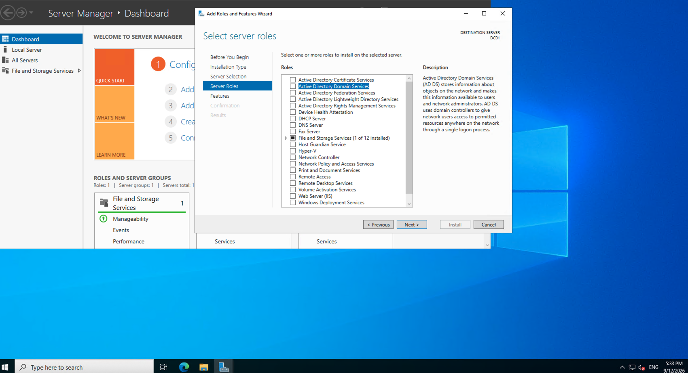
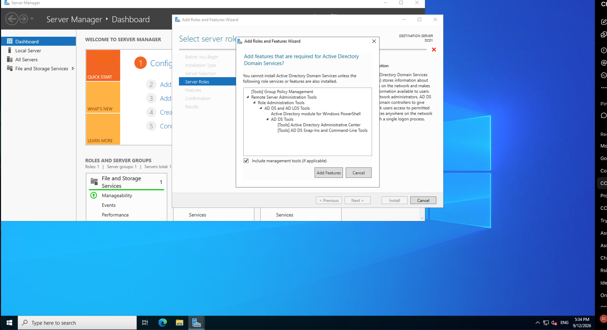
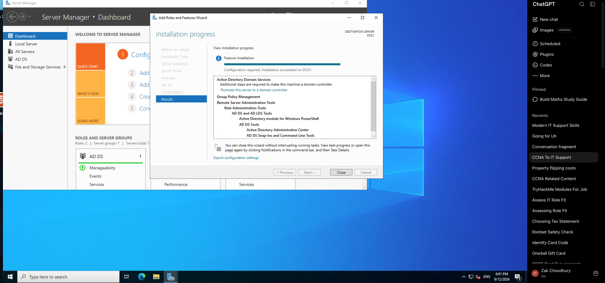
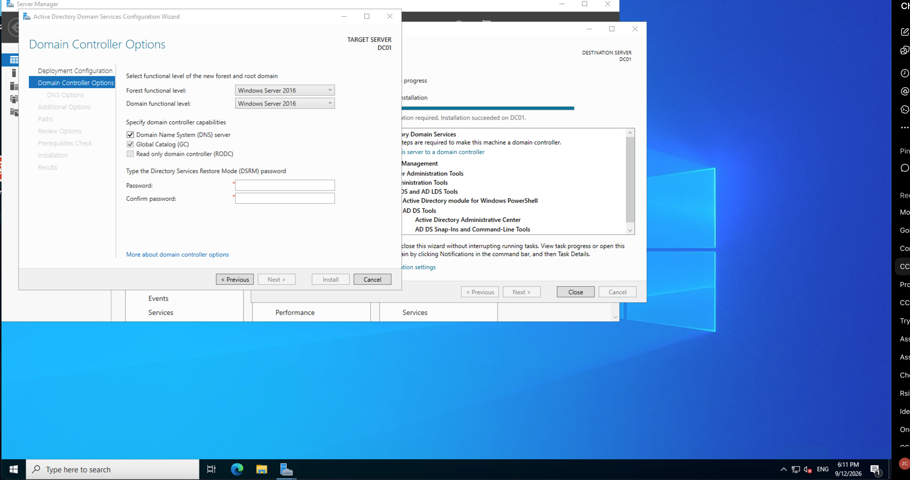
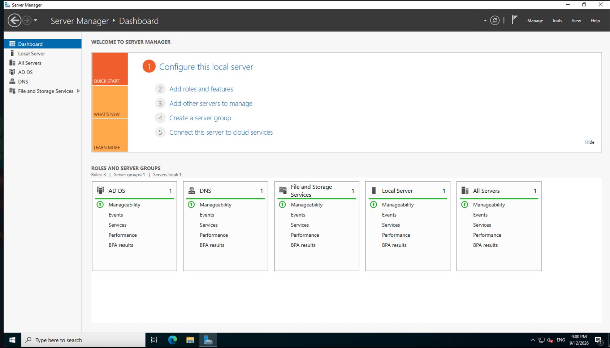

# Active Directory Domain Services Installation

## Objective

Install Active Directory Domain Services (AD DS) on the Windows Server VM `DC01` and prepare the server to become a Domain Controller.

## Environment

- **Server:** DC01
- **Operating System:** Windows Server 2022 Datacenter
- **Platform:** Microsoft Azure
- **Role:** Active Directory Domain Services (AD DS)

## What I Did

1. Connected to `DC01` using Remote Desktop.
2. Opened Server Manager.
3. Selected **Add Roles and Features**.
4. Selected **Role-based or feature-based installation**.
5. Selected `DC01` as the target server.
6. Installed the **Active Directory Domain Services (AD DS)** role.
7. Installed the associated AD DS management tools.
8. Opened the **Active Directory Domain Services Configuration Wizard**.
9. Selected **Add a new forest** to create a new Active Directory environment.
10. Configured the Domain Controller options.
11. Left DNS delegation disabled because this is a new environment.
12. Successfully passed the prerequisite checks.
13. Started the Domain Controller promotion.

### AD DS Role Selection

I selected **Active Directory Domain Services (AD DS)** as the server role to install.



### Required AD DS Features

Windows prompted me to install the required management features for Active Directory Domain Services.



### AD DS Installation Completed

The Active Directory Domain Services role was successfully installed on `DC01`.



### Domain Controller Configuration

I configured the Domain Controller options, including the DNS Server and Global Catalog.



### 5. Domain Controller Promotion Completed

After the server rebooted, Server Manager showed AD DS and DNS, confirming that DC01 was successfully promoted to a Domain Controller.



 — Active Directory Structure

I created an Organizational Unit (OU) structure to organise users and computers by branch and device type.

### 6. Active Directory OU Structure

The following structure was created:

zak.lab.local
└── _Branches
    └── Manchester
        ├── Users
        ├── Workstations
        └── Laptops


## Key Concepts Learned

### Active Directory Domain Services (AD DS)

AD DS is a Windows Server role that provides directory services for managing users, computers, groups and authentication within a Windows domain.

### Domain Controller

A Domain Controller is a server that hosts AD DS and provides authentication and authorization services for the domain.

### Global Catalog

The Global Catalog provides a searchable directory of objects across the Active Directory forest.

### DNS

DNS is closely integrated with Active Directory and allows computers and services to locate Domain Controllers and other domain resources.

## Important Notes

During the promotion process, Windows displayed a DNS delegation warning. This was expected because this lab is creating a new Active Directory environment without an existing parent DNS zone.

The prerequisite checks completed successfully before the promotion began.

## What I Learned

Installing the AD DS role does not automatically make a server a Domain Controller.

The server must first have the AD DS role installed and then be **promoted to a Domain Controller**, which creates/configures the Active Directory environment.

### AD Structure

```text
Forest
   │
   └── Domain
         │
         └── Domain Controller (DC01)
                │
                ├── Users
                ├── Groups
                └── Computers
