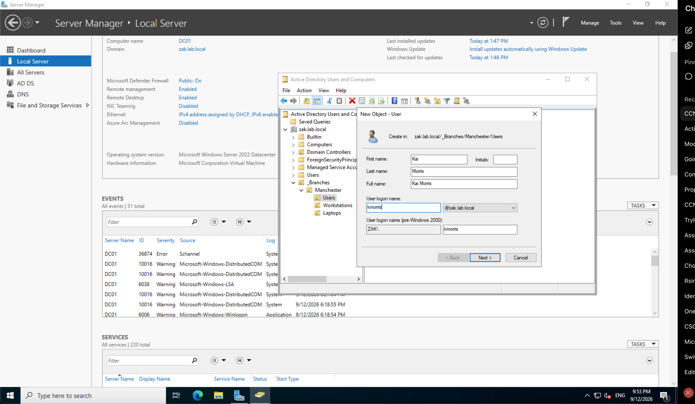
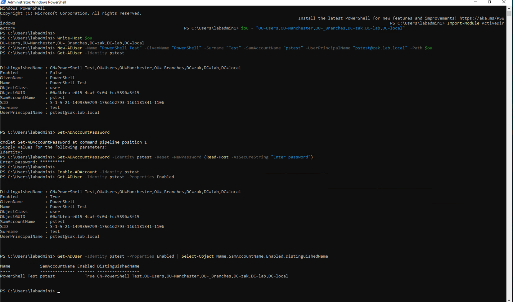

# Active Directory User Creation

## Objective

Create domain user accounts and place them into the correct Organizational Unit (OU) for the Manchester branch.

## Environment

- Domain Controller: DC01
- Domain: zak.lab.local
- Branch: Manchester
- OU: _Branches → Manchester → Users
- Operating System: Windows Server 2022
- Directory Service: Active Directory Domain Services (AD DS)

## What I Did

1. Opened **Active Directory Users and Computers**.
2. Navigated to `_Branches → Manchester → Users`.
3. Created three domain user accounts:
   - Kai Morris (`kmorris`)
   - Ste Johnson (`sjohnson`)
   - Tom Stuart (`tstuart`)
4. Configured each user's logon name and initial password.
5. Verified that all three users were located inside the correct `Users` OU.

## Screenshots

### Creating the First User

The first domain user, Kai Morris, was created inside the `Manchester → Users` OU. 

### More Users Created

After creating the remaining accounts, I verified that Kai Morris, Ste Johnson, and Tom Stuart were all located inside the `Manchester → Users` OU.

### PowerShell User Creation

As an additional exercise, I used PowerShell to automate the creation with the help of AI of a test Active Directory user.

The account was created in the `Manchester → Users` OU, assigned a password, enabled, and then verified using `Get-ADUser`.

## Key Concepts Learned

### Organizational Units (OUs)

OUs are containers used to organise users, computers, and other Active Directory objects.

Placing users into the correct OU allows administrators to apply appropriate Group Policy, delegation, and management settings based on their location or department.

### Security Groups and Permissions

OUs do not directly give users access to files or folders.

Access is normally controlled through security groups and permissions.

