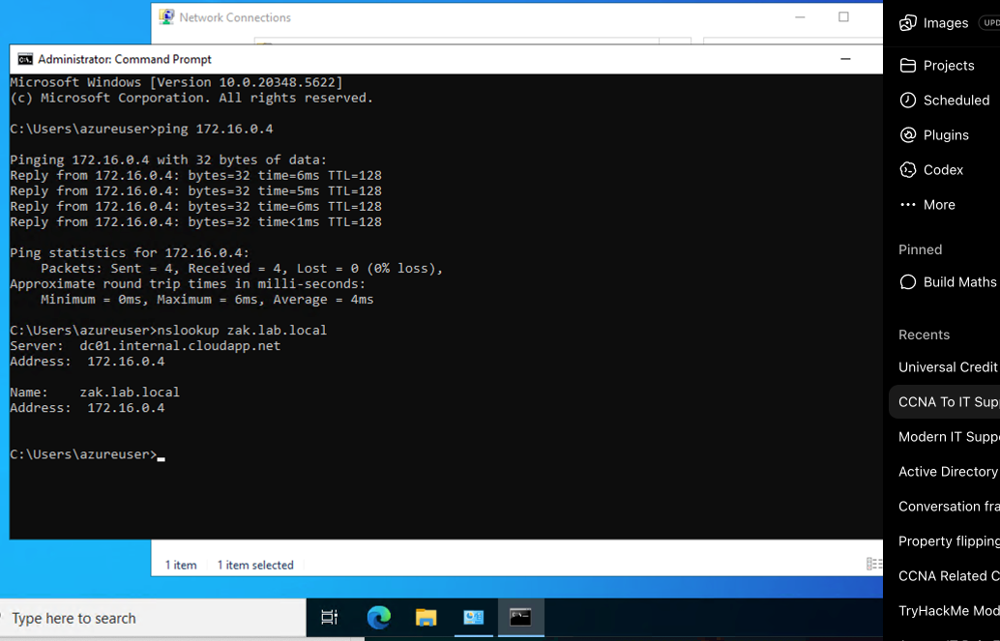
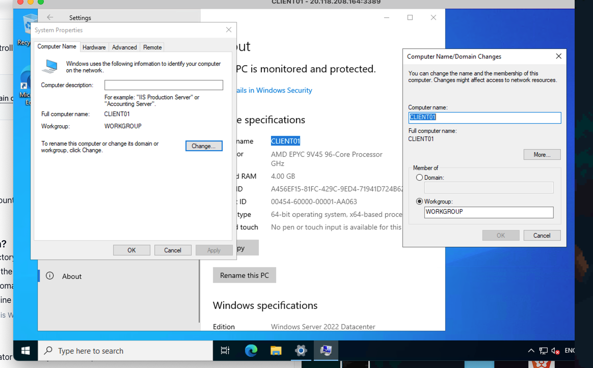
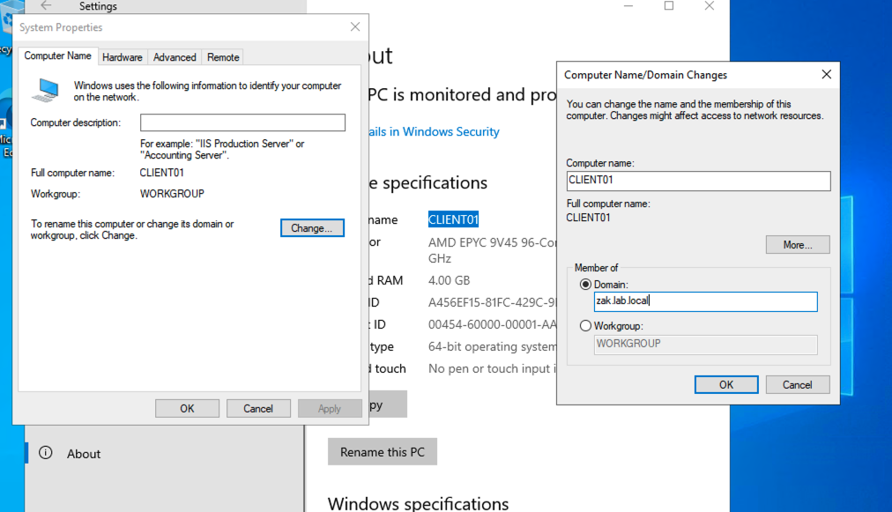
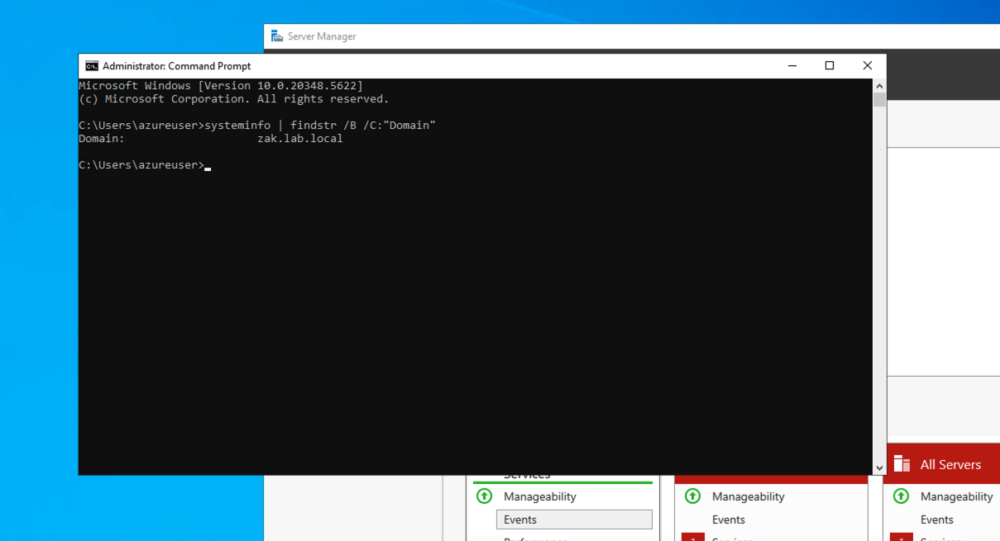

# Client Domain Join

## Objective

Join a client machine to the `zak.lab.local` Active Directory domain and verify that the domain join was successful.

## Environment

- Domain Controller: DC01
- Client Machine: CLIENT01
- Domain: zak.lab.local
- Operating System: Windows Server 2022
- Azure Virtual Network: vnet-centralus-1
- Subnet: snet-centralus-1
- DC01 Private IP: 172.16.0.4

## What I Did

1. Created a separate client virtual machine named `CLIENT01`.
2. Connected CLIENT01 to the same Azure virtual network and subnet as DC01.
3. Configured CLIENT01 to use DC01 (`172.16.0.4`) as its DNS server.
4. Tested network connectivity between CLIENT01 and DC01 using `ping`.
5. Tested DNS resolution for `zak.lab.local` using `nslookup`.
6. Joined CLIENT01 to the `zak.lab.local` domain.
7. Restarted CLIENT01 so the domain membership changes could take effect.
8. Verified after the restart that CLIENT01 was successfully joined to `zak.lab.local`.

## Network Connectivity Test

Before joining the domain, I tested whether CLIENT01 could communicate with the Domain Controller.

Command used:

```cmd
ping 172.16.0.4
```

The test was successful:

```text
Packets: Sent = 4, Received = 4, Lost = 0 (0% loss)
```

This confirmed that CLIENT01 could communicate with DC01 over the network.



## DNS Resolution Test

I then tested whether CLIENT01 could resolve the Active Directory domain using DC01 as its DNS server.

Command used:

```cmd
nslookup zak.lab.local
```

The domain resolved successfully to:

```text
zak.lab.local
172.16.0.4
```

This confirmed that CLIENT01 was correctly using DC01 for DNS resolution.

## Joining CLIENT01 to the Domain

Before joining the domain, CLIENT01 was part of the local `WORKGROUP`.



I selected **Domain** and entered:

```text
zak.lab.local
```



Windows successfully confirmed that CLIENT01 had joined the `zak.lab.local` domain.

CLIENT01 was then restarted so that the domain membership changes could take effect.

## Domain Join Verification

After restarting CLIENT01, I verified the domain membership using:

```cmd
systeminfo | findstr /B /C:"Domain"
```

The output confirmed:

```text
Domain: zak.lab.local
```

This confirmed that CLIENT01 remained successfully joined to the Active Directory domain after the restart.



## Key Concepts Learned

### DNS and Active Directory

Active Directory relies heavily on DNS. The client needs to use the Domain Controller's DNS service so that it can locate and communicate with the domain.

In this lab, CLIENT01 uses:

```text
172.16.0.4
```

as its DNS server because this is the private IP address of DC01.

### Client and Domain Controller

The client computer represents a user's workstation.

The Domain Controller provides Active Directory services, including authentication and directory services.

The basic relationship is:

```text
CLIENT01
    |
    | DNS / Authentication
    ↓
DC01
    |
    └── Active Directory
        └── zak.lab.local
```

### Authentication vs Authorization

Authentication answers:

> Who are you?

Authorization answers:

> What are you allowed to do?

A valid domain account does not automatically mean that the user has permission to Remote Desktop into a computer.

During testing, the standard domain user account was not initially permitted to connect through Remote Desktop. This is an authorization/permission issue rather than a domain join failure.

## Troubleshooting Approach

This lab also reinforced a basic troubleshooting process.

If a client cannot communicate with a Domain Controller, I can start by checking:

```text
IP configuration
      ↓
Network connectivity
      ↓
DNS configuration
      ↓
DNS resolution
      ↓
Domain connectivity
      ↓
Authentication
      ↓
Authorization / permissions
```

This is useful when troubleshooting real IT Support issues because it helps identify where a problem is occurring instead of changing settings randomly.

## What I Learned

I learned how to prepare a client machine for an Active Directory domain join.

I learned how to:

- Connect a client VM to the same Azure network as the Domain Controller.
- Configure the Domain Controller as the client's DNS server.
- Test network connectivity using `ping`.
- Test DNS resolution using `nslookup`.
- Join a client computer to an Active Directory domain.
- Verify domain membership after restarting the client.
- Understand the difference between authentication and authorization.
- Troubleshoot connectivity and DNS issues methodically.

## Lab Structure

```text
zak.lab.local
│
├── _Branches
│   └── Manchester
│       ├── Users
│       ├── Workstations
│       └── Laptops
│
└── OU_Groups
    ├── Helpdesk
    ├── Accounting
    └── ITSupport
```

## Screenshots

### 01 - Network and DNS Test

CLIENT01 successfully communicated with DC01 and resolved `zak.lab.local`.


### 02 - CLIENT01 Before Domain Join

CLIENT01 was initially part of the local `WORKGROUP`.


### 03 - Joining CLIENT01 to the Domain

CLIENT01 was configured to join the `zak.lab.local` domain.


### 04 - Domain Join Verification

After restarting CLIENT01, the domain membership was verified using `systeminfo`.


## Computer Account Organisation

After successfully joining CLIENT01 to the domain, the computer account initially appeared in the default `Computers` container.

I moved CLIENT01 into the appropriate branch structure:

```text
zak.lab.local
└── _Branches
    └── Manchester
        └── Workstations
            └── CLIENT01
```

This keeps computer accounts organised according to their branch and device type and allows appropriate Group Policy and management settings to be applied to the workstation.

## Remote Desktop Verification

I added the domain user `kmorris` to the **Remote Desktop Users** group on CLIENT01.

I then successfully connected to CLIENT01 using the `kmorris` domain account.

I also used:

```cmd
whoami /groups
```

to verify that the logged-in user received their Active Directory security group membership.

This demonstrated the difference between **authentication** and **authorization**:

- Authentication → verifying the user's identity.
- Authorization → determining what the user is allowed to do.

## AI Assistance

AI was used as a learning aid to help understand the Active Directory concepts, DNS configuration, troubleshooting process, and domain join procedure.

The commands and configuration steps were manually performed and verified in my own Windows Server Active Directory lab environment.
